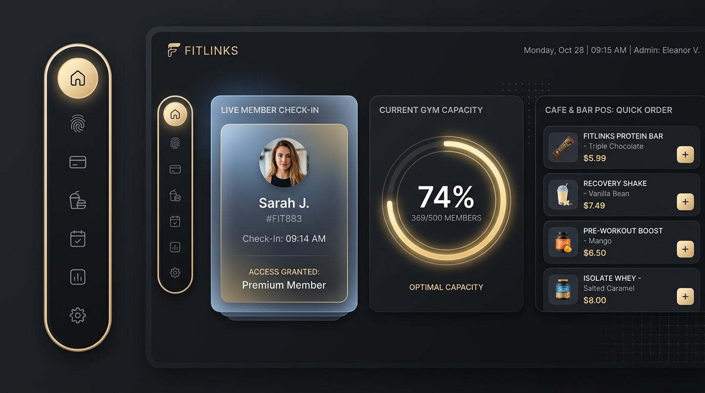
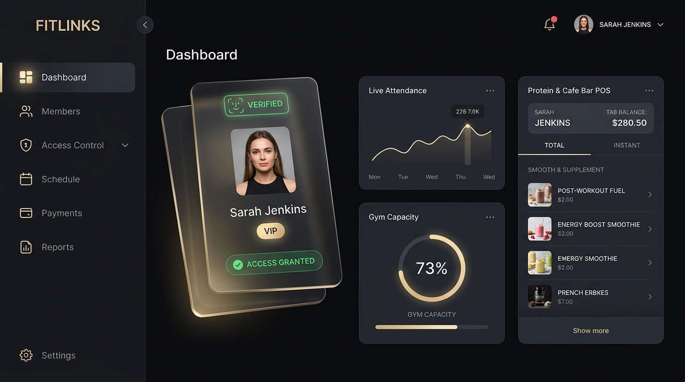
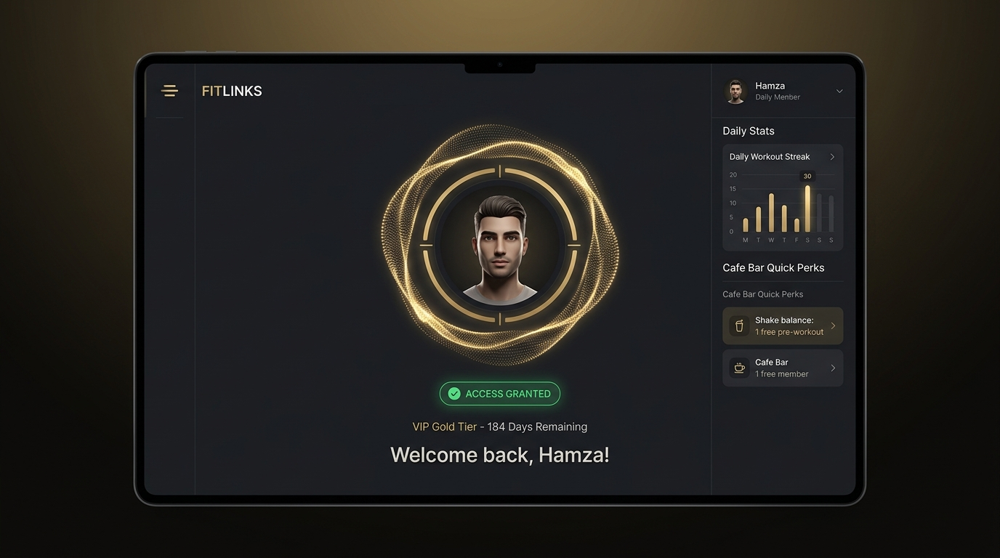

# FITLINKS — Luxury Athletic Club & Attendance System

<p align="center">
  
</p>

> **"Fitness. Connected. Transformed."** — Faisalabad, Pakistan  
> Ultra-Modern 3D Luxury Attendance & Cafe Management System designed for high-end fitness facilities, turnstile gates, and biometric terminals.

---

## 🌟 Key Features

### 1. 🏅 3D Luxury Glassmorphic Interface
- **Floating Capsule / Pill Sidebar Dock**: Detached stadium-shaped navigation pill bar with gold rim glow, illuminated active circular indicators, and smooth micro-tooltips.
- **Interactive 3D Gyro Tilt Cards**: Real-time cursor-following 3D perspective tilt on member access cards with realistic holographic gold sheen.
- **Luxury Sound System**: Custom Web Audio API dual-tone chimes for access granted, denial alerts, and haptic button ticks.
- **Cinematic Dark Luxury Aesthetic**: Obsidian black surfaces (`#070709`) paired with brushed champagne gold accents (`#D4AF37`).

---

<p align="center">
  
  
</p>

---

### 2. ⚡ Real-Time Attendance & Biometric Access
- **Facial Recognition & RFID Verification**: Live scan status HUD with instant member verification.
- **Turnstile Gate Controller**: Real-time rule evaluation (active status, package expiry countdown, time-slot validity e.g., Morning vs Evening).
- **Interactive Kiosk Mode**: 3D particle halo wave scanner designed for front-desk tablets or turnstile kiosks.

### 3. 🥤 Integrated Protein & Cafe Bar POS
- **Quick-Order Catalog**: High-protein shakes, pre-workouts, smoothies, and gym snacks.
- **Member Tab Billing**: Tap any member -> Add items -> Instant digital debit from member's balance.
- **Cash & Card POS Checkout**: Dedicated ticket manager with subtotal and grand total.

### 4. 📊 Live Club Occupancy & Analytics
- Live circular capacity gauge (e.g. 74% capacity, zone split).
- Hourly peak traffic visual bars (Morning vs Evening rush hours).
- Member registry with real-time search & status filtering.

---

## 🔌 Hardware Integration: ZKTeco uFace800 Plus & Turnstiles

This software is architected to interface directly with the **ZKTeco uFace800 Plus** biometric terminal mounted on turnstile tripod barriers:

```
[Member Arrives at Gate]
          │
          ▼
[Face / Fingerprint Scan on uFace800 Plus]
          │
          ▼ (TCP/IP Port 4370)
[FITLINKS Attendance Backend Service]
          │
          ├── Check Active Membership?
          ├── Check Slot Validity?
          └── Check Pending Dues?
          │
   ┌──────┴──────┐
   ▼             ▼
[APPROVED]     [DENIED]
- Signal Relay  - Turnstile Remains Locked
- Open Turnstile- Audio Alert: "Access Denied"
- Dashboard Pop - Receptionist Alert Triggered
```

---

## 🚀 Quick Start (Running Locally)

### Prerequisites
- Any modern web browser (Chrome, Edge, Firefox, Safari).
- Python 3.x (or any local static file server).

### Run
1. Clone the repository:
   ```bash
   git clone https://github.com/mhusnain137/Fit-Links-GYM.git
   cd Fit-Links-GYM
   ```

2. Start the local server:
   ```bash
   python -m http.server 5173
   ```

3. Open your browser and navigate to:
   ```
   http://localhost:5173
   ```

---

## 📁 Project Structure

```
Fit-Links-GYM/
├── assets/                  # High-resolution 3D UI concepts & renders
│   ├── fitlinks_pill_sidebar_ui_*.jpg
│   ├── fitlinks_ui_concept_*.jpg
│   └── fitlinks_kiosk_ui_*.jpg
├── index.html               # Main application shell with floating pill dock
├── styles.css               # Obsidian & brushed gold design tokens & 3D styling
├── app.js                   # 3D gyro tilt, audio synth, live attendance simulator & POS
└── README.md                # Documentation and architecture guide
```

---

## 📜 License
Private & Proprietary — Developed for **FITLINKS Fitness Club, Faisalabad**.
